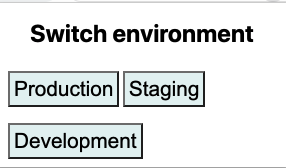

# FL Browser Extension

This is a browser extension for web developers that highlights which environment you are working in.

Note: This project is currently experimental and hardcodes FutureLearn URLs. You will need to fork it to use with other websites.

## Features

### Warning when you are on production

The extension will add a solid red border around all pages in production.

On non-production environments, it will add a dashed border.

### Switching between environments

The extension also adds a menu button which can be used to switch between environments.

## Installation

### For Chrome:

1. Clone the repository
2. Visit [chrome://extensions](chrome://extensions) in your browser.
3. Ensure that the Developer mode checkbox in the top right-hand corner is checked.
4. Click `Load unpacked extension…` to pop up a file selection dialog.
5. Select the extension directory

Source: [Getting Started: Building a Chrome Extension](https://developer.chrome.com/extensions/getstarted#unpacked).

### For Firefox:

Extensions installed using the following instructions are only active while Firefox
is open and are removed on exit. Permanently-active extensions can be only be
installed from packages signed by Mozilla.

1. Clone the repository
2. Visit [about:debugging](about:debugging) in your browser.
3. Click `Load Temporary Add-on` to pop up a file selection dialog.
4. Select the `manifest.json`

Source: [Your first extension](https://developer.mozilla.org/en-US/docs/Mozilla/Add-ons/WebExtensions/Your_first_WebExtension).

## Licence

Code for this extension is released under the [MIT license](LICENSE).
